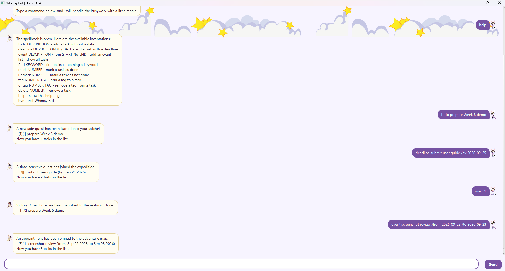

# Whimsy Bot



Whimsy Bot is a cheerful quest manager for organising everyday tasks. You can
create tasks, deadlines, and events, then search, tag, complete, or remove them
from a simple chat-style interface.

## Getting started

Launch Whimsy Bot, then type a command into the box at the bottom of the
window. Press **Enter** or click **Send** to submit it. Type `help` at any time
to display the available commands.

## Features

### Add tasks

Add a task without a date:

```text
todo DESCRIPTION
```

Example:

```text
todo buy groceries
```

Add a deadline:

```text
deadline DESCRIPTION /by DATE_OR_TIME
```

Example:

```text
deadline submit report /by 2026-09-25
```

Add an event with a start and end:

```text
event DESCRIPTION /from START /to END
```

Example:

```text
event project meeting /from Monday 2pm /to Monday 3pm
```

Whimsy Bot prevents duplicate tasks and checks that ISO dates are valid. For
ISO-formatted events, the start date must be earlier than the end date.

### View and search tasks

Display every task:

```text
list
```

Search task descriptions by keyword:

```text
find KEYWORD
```

Example:

```text
find report
```

### Complete and remove tasks

Tasks are identified by the number shown by `list`:

```text
mark NUMBER
unmark NUMBER
delete NUMBER
```

Examples:

```text
mark 1
unmark 1
delete 1
```

### Organise tasks with tags

Add or remove a tag from a task:

```text
tag NUMBER TAG
untag NUMBER TAG
```

Examples:

```text
tag 1 school
untag 1 school
```

Tags may contain letters, numbers, underscores, and hyphens. They may also be
written with a leading `#`, such as `tag 1 #school`.

### Get help or exit

Display the complete command list:

```text
help
```

Exit the application:

```text
bye
```

## Error messages

If a command is incomplete, unknown, refers to a task number that does not
exist, or contains invalid data, Whimsy Bot displays an explanatory error
message and remains ready for the next command. Your tasks are saved in the
`data` folder relative to the folder from which the application is run.
